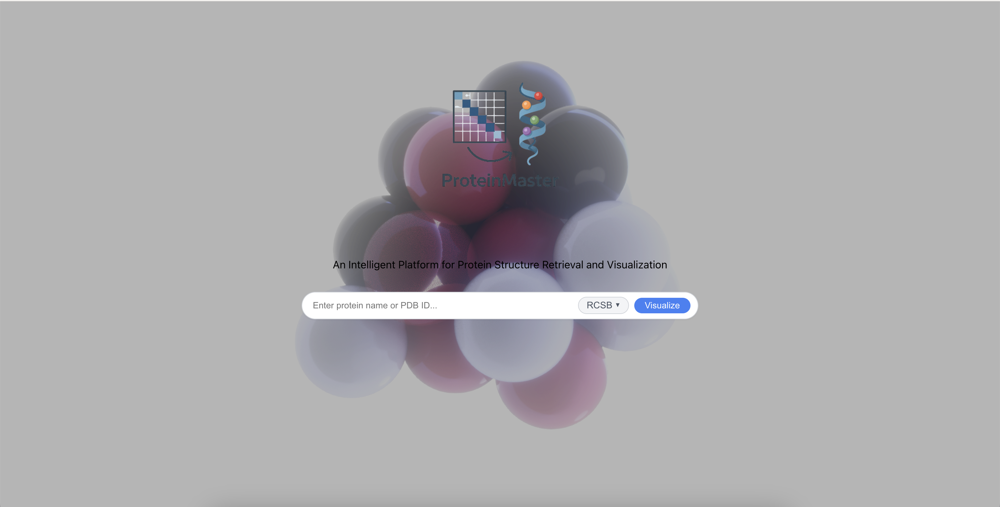
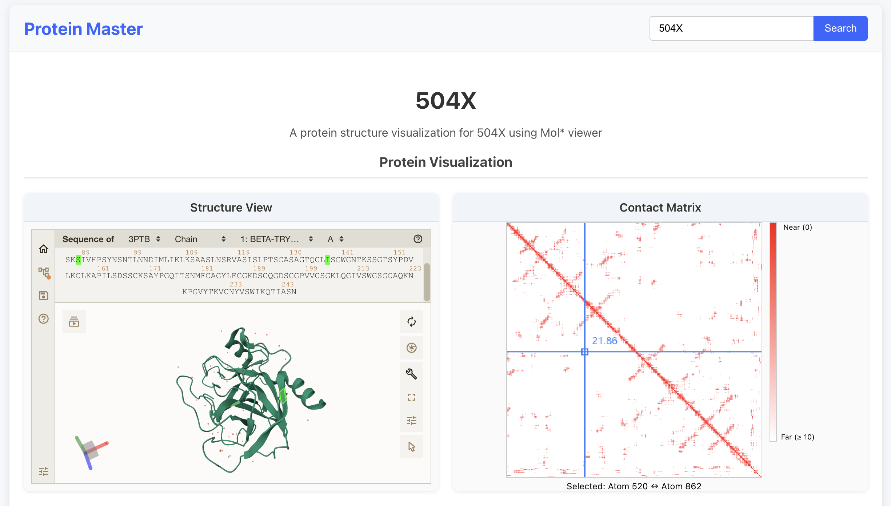

# protein-master-project

## Prerequirement
```
➜  protein-master-project git:(main) ✗ npm -v      
10.9.2

➜  protein-master-project git:(main) ✗ python --version    
Python 3.12.7

➜  protein-master-project git:(main) ✗ pip --version
pip 24.3.1
```

## Quick Start
```
./build.sh
```

If you find something like this in the terminal, it means the startup is successful.
```
Frontend environment setup complete.
Starting the backend server...
Backend server started with PID=99673
Starting the frontend development server...
Frontend server started with PID=99674
Both servers have been started. Waiting for processes to finish...
```

Then, please visit `http://localhost:3000/` in your browser. You should see a page like this:



For example, you can try ProteinID: 504X. Then you can go to the following page:


## Init Submodules
```
git submodule init
git submodule update
```

## Start Backend & frontend
[Backend](./backend/README.md) <br>
[Frontend](./frontend/README.md)